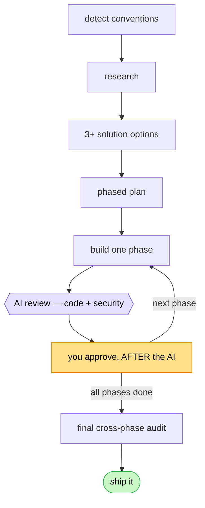

# 🛠️ dev-workflow

**A spec-driven development workflow for Claude Code — domain-agnostic, review-gated, safe by default.**

Every feature runs the same disciplined gauntlet — and *you* are the final boss at every gate:



> Pair programming, except your pair is six robots who *actually read the spec* — and you still hold the almighty **“nope.”**

The domain isn't hardcoded — it's read from your `conventions.md` (via `/dev-workflow:init`) or inferred per feature from the code.

## Install

```shell
/plugin marketplace add tandnguyendev/dev-workflow
/plugin install dev-workflow@dev-workflow-marketplace
```

> Update later: `/plugin marketplace update dev-workflow-marketplace`

## Quick start

```shell
/dev-workflow:init                       # (optional) learn the repo → conventions.md
/dev-workflow:feature add pagination to the orders endpoint
/dev-workflow:status                     # where am I?  (also auto-injected each session)
```

Working docs scaffold automatically under `.dev-workflow/features/<slug>/`; multiple features can run at once (`.dev-workflow/active` names the current one).

## What's inside

**Commands & skills**

| Command | Purpose |
|---------|---------|
| `/dev-workflow:init` | Inspect the project, draft `conventions.md` |
| `/dev-workflow:feature` | Drive the whole feature workflow (orchestrator) |
| `/dev-workflow:status` | Readout of the active feature / phase / gate |
| `/dev-workflow:checkpoints` | List auto-snapshots |
| `/dev-workflow:rollback` | Restore to a checkpoint (safe, reversible) |

**Subagents** — model routing is a sensible default (cheap models scout; Opus codes & audits). Change it in any `agents/*.md`.

| Agent | Model | Role |
|-------|-------|------|
| `domain-researcher` | Haiku 4.5 | Domain/stack research (read-only + web) |
| `solution-architect` | Haiku 4.5 | One solution option per angle (panel) |
| `coder` | Opus 4.8 | Implement one phase |
| `code-reviewer` | inherit | Logic/quality review |
| `security-scan-fast` | Fable 5 | Fast per-phase security scan |
| `security-audit` | Opus 4.8 | Deep final cross-phase audit |

## Safety & reliability

Four hooks make the workflow *trustworthy*, not just well-behaved. All fail open and stay silent when no workflow is active.

| | Gives you |
|---|---|
| 🔒 **Approval gate** | A hard `LOCKED` gate only *you* can flip |
| 💾 **Checkpoints + rollback** | Auto git snapshots before every edit; safe reversible restore |
| 🧾 **Evidence gate** | "Done" needs cited proof, not "looks fine" |
| ♻️ **Context re-injection** | Workflow state survives `/compact` |

<details>
<summary><b>🔒 Approval gate</b> — how it works</summary>

<br>A `PreToolUse` hook (`hooks/gate.py`) blocks `Edit`/`Write`/`MultiEdit` on source code while a `.approval-gate` file at your project root says `LOCKED`. Opt-in — does nothing until the file exists.

- Working docs (`spec.md`, `plan.md`, `phase-log.md`) stay editable while locked.
- **Only you can unlock**, from your own shell — Claude can't. The edit tools are blocked, and Bash is **deny-by-default**: any command that references `.approval-gate` is refused (a denylist of write tricks — `python -c`, here-docs, `install` — can't be exhaustive). A rollback can't flip it either: gate state is preserved and never snapshotted.

```shell
! echo LOCKED > .approval-gate      # activate + lock
! echo UNLOCKED > .approval-gate    # after approving a phase
```

The `!` prefix runs in *your* shell, so it isn't a Claude tool call the hook can intercept.
</details>

<details>
<summary><b>💾 Checkpoints & rollback</b> — how it works</summary>

<br>In a git repo, a `PreToolUse` hook (`hooks/checkpoint.py`) snapshots the working tree before every mutating tool call to a shadow ref `refs/dev-workflow/checkpoints/<ts>` — via git plumbing on a temp index, so it **never touches your index / HEAD / branch / worktree**. Fail-open, with a timeout.

- `/dev-workflow:checkpoints` — list snapshots (newest first).
- `/dev-workflow:rollback [ref]` — restore to a checkpoint (default: latest). It first saves current state as a reversible `pre-rollback` checkpoint (`undo` reverses it); never moves your branch, never hard-deletes.

Rollback restores tracked *content*; files created since are left in place (they show in `git status`).

**v1 limits:** git only · no auto-pruning — refs are local (not pushed); prune with
`git for-each-ref --format='delete %(refname)' refs/dev-workflow | git update-ref --stdin` · snapshots respect `.gitignore`, so keep secrets ignored.
</details>

<details>
<summary><b>🧾 Evidence gate</b> — how it works</summary>

<br>Completion checkpoints ask for *cited proof*. Each phase's `phase-log.md` has an `- Evidence:` ledger to fill with concrete artifacts — test/command output, `file:line` references, the cases verified — one per acceptance criterion. Review subagents back every verdict with what they actually checked.

A `Stop` hook (`hooks/evidence_guard.py`) enforces it: end a turn with the current phase marked reviewed but its Evidence ledger empty, and it blocks **once** to ask for proof. Fail-open, honors `stop_hook_active` (so it can never hard-lock a turn), silent unless a phase-log is active.
</details>

<details>
<summary><b>♻️ Context re-injection</b> — how it works</summary>

<br>A `SessionStart` hook (`hooks/status.py`) re-surfaces the active feature, phase progress, and gate state at every session start — **including after `/compact` or auto-compaction** (it fires with `source: "compact"` and adds a "context was just compacted — re-read the files" reminder). This keeps the file-based source of truth (`spec.md` / `plan.md` / `phase-log.md`) from being lost to context rot.
</details>

## Under the hood

- **Files are the source of truth** — `spec.md` / `plan.md` / `phase-log.md` survive `/compact` and `/clear`. Re-read them, don't trust conversation memory.
- **You review AFTER the AI** reviewers at every phase; nothing advances unapproved.
- **Token triage** — the `feature` skill sizes each job (trivial / standard / complex) and scales the machinery: trivial skips research + the option panel and uses one reviewer; complex runs the full 3-agent panel, both reviewers per phase, and a full final audit.
- **Domain context** ships per-project via `conventions.md` (plugins can't ship a project `CLAUDE.md`). Greenfield code with no stated convention falls back to a minimal, subordinate `references/clean-code.md` baseline — the project's own linter always wins.

## Requirements

- **Python** on PATH (`python` / `python3`; on Windows ensure `python`, not only `py`) — used by the hooks.
- **Git** for checkpoints/rollback (the other features work without it).
- Add **`.dev-workflow/`** to your project `.gitignore`.
